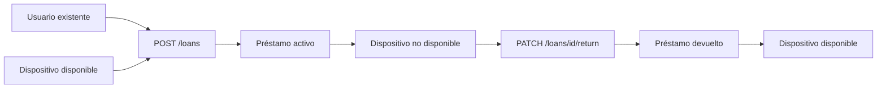
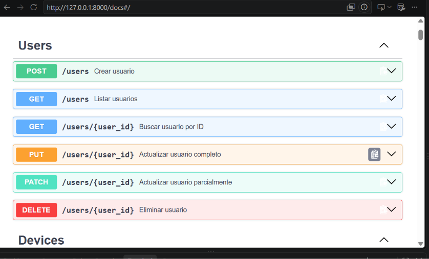
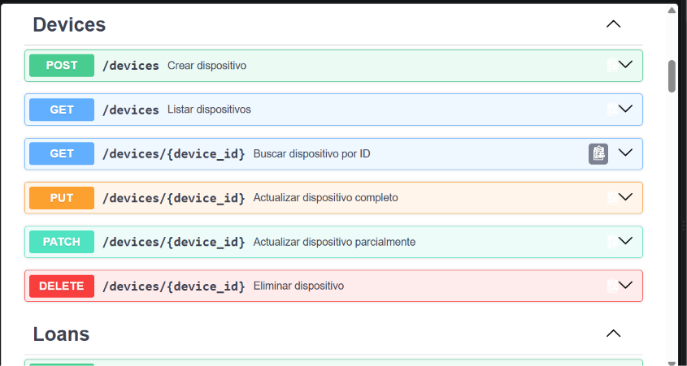
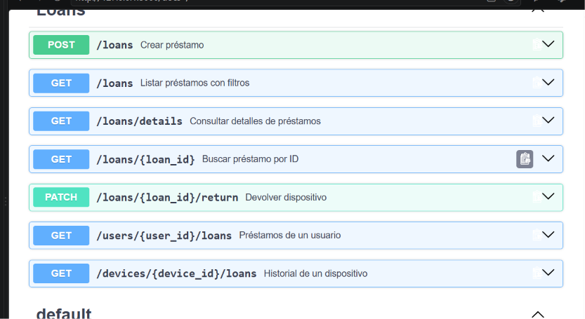
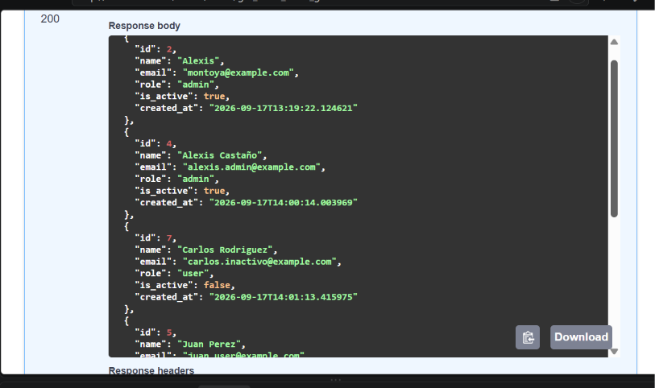
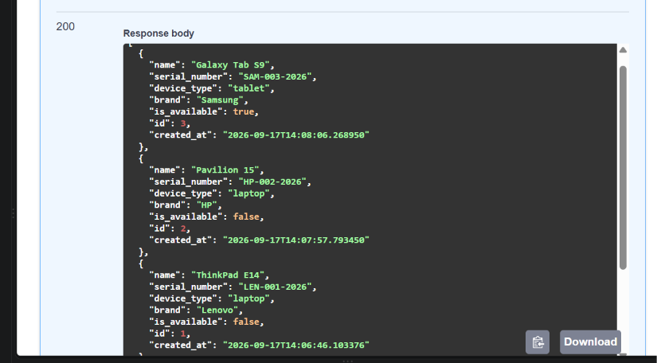
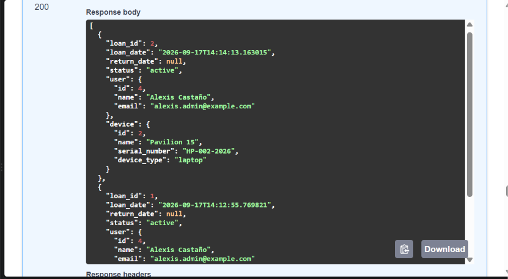
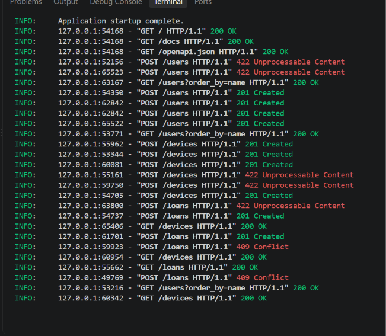

# device_systems

API REST para gestionar usuarios, dispositivos tecnológicos y préstamos con FastAPI, SQLAlchemy, SQLite y Alembic.


## Resumen

`device_systems` es una API backend para controlar un inventario de equipos tecnológicos y su historial de préstamos. El proyecto demuestra cómo pasar de un CRUD de usuarios a un sistema relacional con migraciones, claves foráneas, relaciones ORM, consultas con joins y reglas de negocio.

## Índice

- [Objetivo](#objetivo-de-la-actividad)
- [Funcionalidades](#funcionalidades-implementadas)
- [Arquitectura](#arquitectura)
- [Instalación](#instalacion)
- [Migraciones](#migraciones-con-alembic)
- [Ejecución](#ejecucion)
- [Endpoints](#endpoints-principales)
- [Pruebas](#pruebas-funcionales)
- [Evidencias](#evidencias-de-entrega)
- [Rama de trabajo](#rama-de-trabajo)
- [Reflexión final](#reflexion-final)

## Objetivo de la actividad

Esta actividad evoluciona el CRUD de usuarios de la guía anterior hacia un sistema backend relacional. El objetivo principal es incorporar migraciones controladas con Alembic, asociaciones entre los modelos `User`, `Device` y `Loan`, y consultas avanzadas con `join`, filtros y relaciones.

La API conserva el recurso `/users` y agrega `/devices` y `/loans`. El sistema permite registrar usuarios y dispositivos, crear préstamos, impedir préstamos de dispositivos no disponibles, consultar historiales y devolver equipos actualizando su disponibilidad.

## Funcionalidades implementadas

- CRUD de usuarios persistido en SQLite.
- CRUD de dispositivos con número de serie único.
- Relaciones `User -> Loan`, `Device -> Loan` y `Loan -> User/Device`.
- Creación de préstamos con validación de usuario, dispositivo y disponibilidad.
- Devolución de préstamos con fecha de retorno y disponibilidad restaurada.
- Historial de préstamos por usuario y por dispositivo.
- Filtros por estado, correo de usuario, tipo de dispositivo, marca y texto.
- Migraciones versionadas con Alembic.
- Validaciones Pydantic y respuestas documentadas en OpenAPI.

## Arquitectura

| Capa | Responsabilidad |
| --- | --- |
| `models` | Tablas, columnas, claves foráneas y relaciones SQLAlchemy. |
| `schemas` | Validación de datos de entrada y salida con Pydantic. |
| `routes` | Endpoints HTTP y códigos de respuesta. |
| `services` | Consultas, reglas CRUD y transacciones. |
| `dependencies` | Sesión de base de datos por solicitud. |
| `alembic` | Migraciones versionadas de la base de datos. |

### Flujo de un préstamo



## Tecnologías

- Python 3.14
- FastAPI
- Uvicorn
- SQLAlchemy 2
- Alembic
- Pydantic 2
- email-validator
- SQLite

## Estructura del proyecto

```text
device_systems/
├── app/
│   ├── main.py
│   ├── database/connection.py
│   ├── dependencies/database_dependency.py
│   ├── models/
│   │   ├── user_model.py
│   │   ├── device_model.py
│   │   └── loan_model.py
│   ├── schemas/
│   │   ├── user_schema.py
│   │   ├── device_schema.py
│   │   └── loan_schema.py
│   ├── routes/
│   │   ├── user_routes.py
│   │   ├── device_routes.py
│   │   └── loan_routes.py
│   └── services/
│       ├── user_service.py
│       ├── device_service.py
│       └── loan_service.py
├── alembic/
│   ├── versions/
│   ├── env.py
│   └── script.py.mako
├── img/
│   ├── Ev1.png
│   ├── Ev2.png
│   ├── Ev3.png
│   ├── Ev4.png
│   ├── Ev5.png
│   ├── Ev6.png
│   └── Ev7.png
├── alembic.ini
├── device_systems.db
├── requirements.txt
└── README.md
```

## Modelo de datos y relaciones

### User

Representa a las personas que utilizan el sistema. Conserva los campos `id`, `name`, `email`, `role`, `is_active` y `created_at`.

### Device

Representa los equipos disponibles para préstamo:

| Campo | Tipo | Restricción |
| --- | --- | --- |
| `id` | Integer | Clave primaria |
| `name` | String | Obligatorio |
| `serial_number` | String | Obligatorio, único e indexado |
| `device_type` | String | laptop, tablet, proyector, cámara, router o monitor |
| `brand` | String | Opcional |
| `is_available` | Boolean | Por defecto `True` |
| `created_at` | DateTime | Fecha automática |

### Loan

Representa el préstamo de un dispositivo a un usuario. Contiene `user_id` y `device_id` como claves foráneas, además de `loan_date`, `return_date` y `status`. Los estados permitidos son `active`, `returned` y `overdue`.

Un usuario puede tener muchos préstamos y un dispositivo puede aparecer en varios préstamos históricos. Cada préstamo pertenece exactamente a un usuario y a un dispositivo mediante `ForeignKey()` y `relationship()` con `back_populates`.

## Requisitos previos

- Python 3.11 o superior.
- Git.
- PowerShell o una terminal compatible con entornos virtuales.

La aplicación utiliza SQLite, por lo que no requiere instalar un servidor de base de datos adicional.

## Instalación

Desde la raíz del proyecto:

```powershell
python -m venv venv
.\venv\Scripts\Activate.ps1
python -m pip install --upgrade pip
python -m pip install -r requirements.txt
```

## Migraciones con Alembic

La base de datos se configura en `alembic.ini` con SQLite:

```text
sqlite:///./device_systems.db
```

La metadata de SQLAlchemy se carga en `alembic/env.py` desde los modelos de la aplicación. Los comandos principales son:

```powershell
alembic history
alembic revision --autogenerate -m "create devices and loans tables"
alembic upgrade head
```

En este proyecto existe una migración versionada en `alembic/versions/8d44b2c4a063_create_devices_and_loans_tables.py`, que crea las tablas `devices` y `loans` sobre la tabla `users` existente.

Para comprobar que no existen cambios de esquema pendientes:

```powershell
.\venv\Scripts\alembic.exe check
```

## Ejecución

Primero aplica las migraciones y después inicia la API:

```powershell
.\venv\Scripts\Activate.ps1
alembic upgrade head
python -m uvicorn app.main:app --reload
```

La API queda disponible en:

- API: <http://127.0.0.1:8000>
- Swagger UI: <http://127.0.0.1:8000/docs>
- ReDoc: <http://127.0.0.1:8000/redoc>

Para detener el servidor, presiona `Ctrl+C`.

## Endpoints principales

### Users

| Método | Ruta | Descripción |
| --- | --- | --- |
| `GET` | `/users` | Lista, filtra y ordena usuarios |
| `GET` | `/users/{user_id}` | Consulta un usuario |
| `POST` | `/users` | Crea un usuario |
| `PUT` | `/users/{user_id}` | Reemplaza un usuario |
| `PATCH` | `/users/{user_id}` | Actualiza parcialmente |
| `DELETE` | `/users/{user_id}` | Elimina un usuario |

### Devices

| Método | Ruta | Descripción |
| --- | --- | --- |
| `GET` | `/devices` | Lista y filtra dispositivos |
| `GET` | `/devices/{device_id}` | Consulta un dispositivo |
| `POST` | `/devices` | Registra un dispositivo |
| `PUT` | `/devices/{device_id}` | Actualiza completamente |
| `PATCH` | `/devices/{device_id}` | Actualiza parcialmente |
| `DELETE` | `/devices/{device_id}` | Elimina si no tiene historial |
| `GET` | `/devices/{device_id}/loans` | Consulta el historial del equipo |

Filtros disponibles en `GET /devices`: `device_type`, `is_available`, `brand` y `search`.

### Loans

| Método | Ruta | Descripción |
| --- | --- | --- |
| `GET` | `/loans` | Lista préstamos con filtros y relaciones |
| `GET` | `/loans/details` | Consulta detalles con usuario y dispositivo |
| `GET` | `/loans/{loan_id}` | Consulta un préstamo |
| `POST` | `/loans` | Crea un préstamo activo |
| `PATCH` | `/loans/{loan_id}/return` | Devuelve el dispositivo |
| `GET` | `/users/{user_id}/loans` | Consulta préstamos de un usuario |

Filtros disponibles en `/loans`: `status`, `user_email` y `device_type`.

Ejemplos de consultas:

```text
GET /devices?device_type=laptop&is_available=true
GET /devices?brand=lenovo&search=thinkpad
GET /loans?status=active&device_type=laptop
GET /loans/details?user_email=ana@example.com
GET /users/1/loans
GET /devices/1/loans
```

## Ejemplos de solicitudes

Crear un dispositivo:

```json
{
  "name": "ThinkPad T14",
  "serial_number": "LEN-2024-001",
  "device_type": "laptop",
  "brand": "Lenovo",
  "is_available": true
}
```

Crear un préstamo:

```json
{
  "user_id": 1,
  "device_id": 1
}
```

La respuesta detallada de un préstamo incluye el estado, las fechas y los datos básicos del usuario y del dispositivo.

Ejemplo de respuesta detallada:

```json
{
  "loan_id": 1,
  "status": "active",
  "loan_date": "2026-09-17T10:30:00",
  "return_date": null,
  "user": {
    "id": 1,
    "name": "Ana Perez",
    "email": "ana@example.com"
  },
  "device": {
    "id": 1,
    "name": "ThinkPad T14",
    "serial_number": "LEN-2024-001",
    "device_type": "laptop"
  }
}
```

## Manejo de errores

| Situación | Código |
| --- | --- |
| Registro creado | `201 Created` |
| Consulta o actualización exitosa | `200 OK` |
| Eliminación exitosa | `204 No Content` |
| Recurso inexistente | `404 Not Found` |
| Email o serial duplicado | `400 Bad Request` |
| Dispositivo no disponible o préstamo ya devuelto | `409 Conflict` |
| Datos inválidos o filtro no permitido | `422 Unprocessable Entity` |

## Pruebas funcionales

La implementación fue verificada con un servidor Uvicorn en un puerto temporal:

- Migración aplicada con `alembic upgrade head`.
- Usuario creado correctamente.
- Dispositivo creado correctamente.
- Préstamo creado y marcado como `active`.
- Segundo préstamo del mismo dispositivo rechazado con `409`.
- Consulta `/loans/details` con filtros y datos relacionados.
- Historial consultado desde `/users/{user_id}/loans` y `/devices/{device_id}/loans`.
- Dispositivo devuelto con `PATCH /loans/{loan_id}/return`.
- Disponibilidad restaurada a `true`.
- Segunda devolución rechazada con `409`.

Validaciones técnicas ejecutadas:

```powershell
python -m compileall -q app alembic
.\venv\Scripts\alembic.exe check
```

Resultado esperado:

```text
No new upgrade operations detected.
```

## Evidencias de entrega

A continuación se presentan las capturas de pantalla organizadas que sirven como evidencia de la implementación y pruebas funcionales del proyecto:

### 1. Estructura de archivos y carpeta de evidencias (`img/`)
Muestra la organización del proyecto con la carpeta `img/` conteniendo de `Ev1.png` a `Ev7.png`.



---

### 2. Documentación Swagger UI - Endpoints de Usuarios (`/users`)
Visualización interactiva OpenAPI para la gestión del recurso de usuarios.



---

### 3. Documentación Swagger UI - Endpoints de Dispositivos (`/devices`)
Visualización interactiva OpenAPI para la gestión del catálogo de dispositivos tecnológicos.



---

### 4. Documentación Swagger UI - Endpoints de Préstamos (`/loans`)
Visualización interactiva OpenAPI para la administración, filtros e historial de préstamos.



---

### 5. Respuesta exitosa GET /users
Consulta exitosa de usuarios registrados con respuesta HTTP 200 OK.



---

### 6. Respuesta exitosa GET /devices
Consulta del listado de dispositivos registrados con sus estados de disponibilidad y especificaciones.



---

### 7. Logs de ejecución en consola (HTTP requests & Status codes)
Logs del servidor Uvicorn con operaciones HTTP (201 Created, 200 OK, 409 Conflict por regla de negocio, 422 Unprocessable Entity por validación).



---

## Rama de trabajo

La actividad solicita una rama llamada:

```text
device_systems_alembic_relaciones
```

Después de verificar los cambios, debe integrarse con `main` y publicarse en el repositorio GitHub del proyecto.

## Reflexión final

Alembic permite evolucionar la estructura de la base de datos de forma controlada y reproducible. Las relaciones garantizan la integridad entre usuarios, equipos y préstamos, mientras que los joins permiten responder consultas útiles sin duplicar datos en la API. Esta combinación transforma un CRUD básico en un sistema backend preparado para crecer y mantener un historial confiable de operaciones.